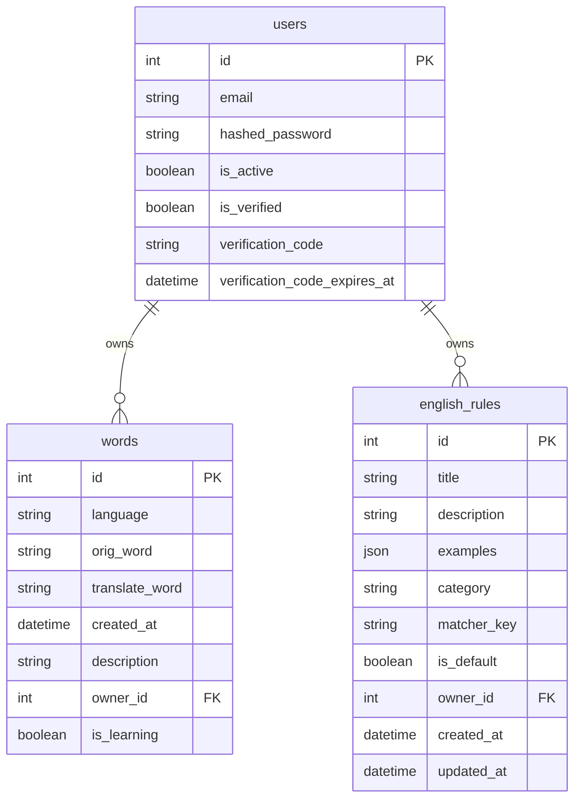
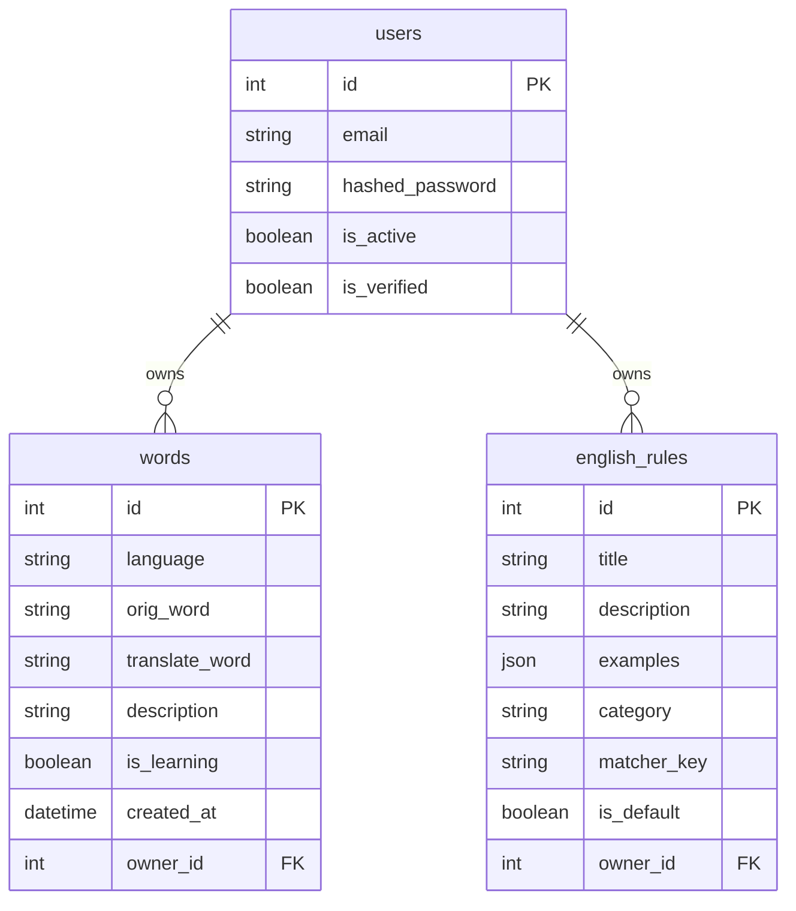

# Схема базы данных

Документ фиксирует текущую схему БД и целевое направление для мультиязычных словарей.

## Текущая схема



Сейчас все слова лежат в одной таблице `words` и принадлежат пользователю через `owner_id`.
Поле `language` хранит код языка слова: `en`, `de`, `fr`, `es` или `it`.

## Принцип нескольких языков

Чтобы пользователь мог учить английский, французский, немецкий и другие языки одновременно, мы не создаем отдельную таблицу для каждого языка. Для этого используется поле `language` в таблице `words`.



Пример данных в будущей схеме:

```text
id | owner_id | language | orig_word | translate_word | is_learning
1  | 1        | en       | hello     | привет         | true
2  | 1        | en       | table     | стол           | false
3  | 1        | fr       | bonjour   | привет         | true
4  | 1        | fr       | maison    | дом            | true
5  | 1        | de       | haus      | дом            | false
```

## Почему одна таблица words лучше отдельных таблиц

Не рекомендуется делать таблицы `english_words`, `french_words`, `german_words` и так далее.

Причины:

- одинаковая структура слов будет дублироваться в нескольких таблицах;
- придется дублировать API-ручки;
- сложнее делать общую статистику;
- сложнее добавлять новые языки;
- сложнее поддерживать пагинацию и проверку слов.

Одна таблица `words` с полем `language` проще и масштабируется нормально.

## Индексы для будущей мультиязычности

Когда появится поле `language`, полезно добавить индексы под основные запросы:

```sql
CREATE INDEX ix_words_owner_language
ON words (owner_id, language);

CREATE INDEX ix_words_owner_language_learning
ON words (owner_id, language, is_learning);

CREATE INDEX ix_words_owner_language_created_at
ON words (owner_id, language, created_at DESC);
```

Эти индексы помогут быстро получать словарь конкретного пользователя по выбранному языку.

## Следующий возможный этап

После слов можно расширить правила:

- переименовать `english_rules` в более универсальную таблицу `language_rules`;
- добавить поле `language`;
- хранить стартовые правила отдельно для каждого языка.
